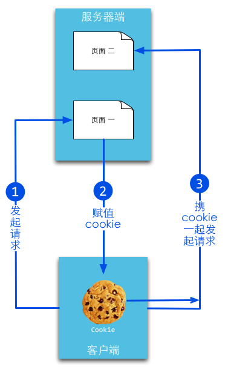

# Go notes

## Cookie and Session

### Basic Principle




Cookies are of 2 types: **session cookie** and **persistent cookie**:

- **session cookie** is gone when the session is over, normally after the browser is turned off. For this property, it is usually stored in the RAM.
- **persistent cookie**  has a property called `setMaxAge(606024)`. The browser will store it till it dies. In this way, cookie can be shared by different processes such as 2 IE windows.

### Set cookie in go

```go
http.SetCookie(w ResponseWriter, cookie *Cookie) // w is the response
											//  you want to write
type Cookie struct {
    Name string
    Value string
    Path string
    Domain string
    Expires time.Time
    RawExpires string
    MaxAge int // <0:delete cookie now; =0:no max-age attribute    		 
    Secure bool // specified; >0: maxage
    HttpOnly bool
    Raw string
    Unparsed []string // Raw text of unparsed attribute-value pairs
}
```

```go
expiration := time.Now()
expiration = expiration.AddDate(1, 0, 0)
cookie := http.Cookie{Name: "username", Value:"tctco", Expires: expiration}
http.SetCookie(w, &cookie)
```

### Read cookie in go

```go
cookie, _ := r.Cookie("username")
fmt.Fprint(w, cookie)
```

```go
fot _, cookie := range r.Cookies() {
    fmt.Fprint(w, cookie.Name)
}
```

