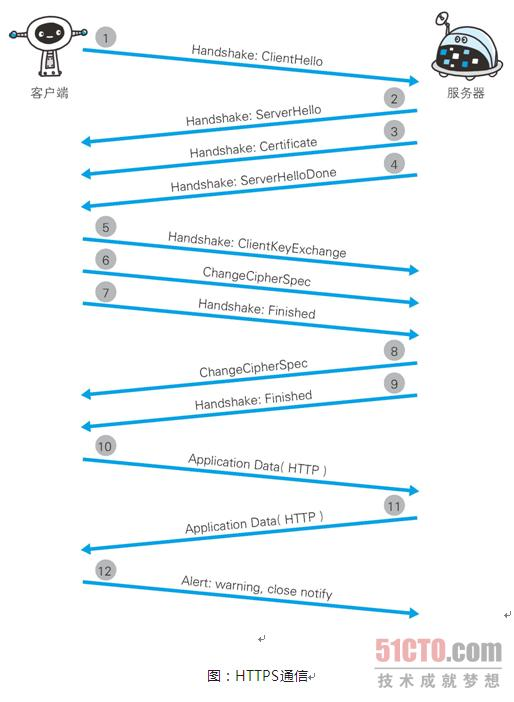
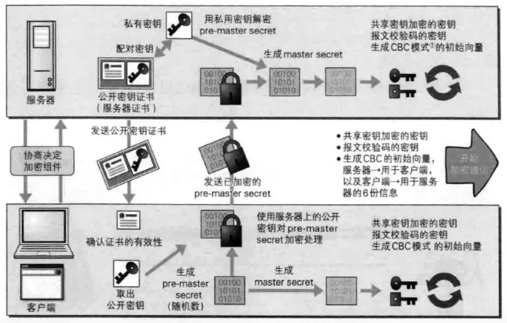
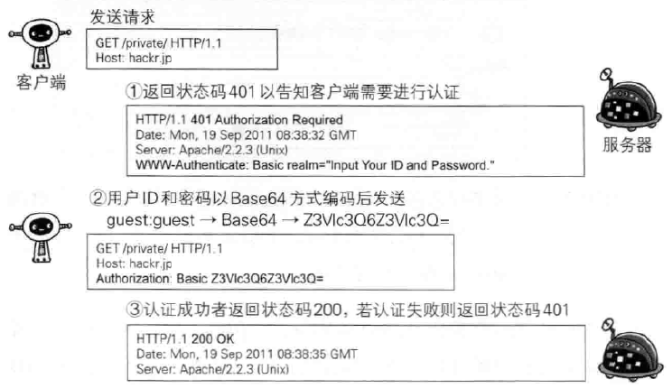
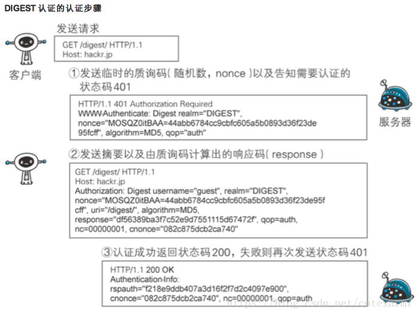

# HTTP notes

## HTTPS

### Security issues of http

- **TCP/IP** can be wiretapped by **Sniffers** or **Packet Capture** software.

  To solve this problem, one common way is to use **SSL(Security Socket Layer)** and **TLS(Transport Layer Security)**. The combination of SSL and HTTP is called **HTTPS**. The other way is to encrypt the http message.

- http doesn't verify the target, which means that it may encounter disguise behavior.

  - Anyone can start a request.
  - Cannot tell whether the server is the one you want to connect.
  - Cannot tell whether the client is the one you want to respond.
  - Cannot tell the authority of the client.
  - Cannot tell who and where the request is from.
  - Accept all kinds of meaning less requests. Cannot stop **DoS(Denial of Service)** attack.

  - **Certification**: SSL not only provide secured communication, but also provide a function called **certification**. This can verify that the server and client do exist.

- Cannot tell whether the http message is complete or has been tempered.

  - The message received may be wrong. Once the file is sent from the server, the file can be changed during the transportation but the client has no way to detect it. This is called **MITM(Man-in-the-Middle) attack**.
  - Method to prevent this:
    - **MD5** and **SHA-1** etc Hash value check and some kind of digital signature.
    - For downloading sites: **PGP(Pretty Good Privacy)** signature and hash value generated by **MD5**.
    - Vulnerabilities: Once the **PGP** or **MD5** are changed, the user cannot tell.
    - SSL provides verification, encryption and abstraction.

### HTTPS = HTTP + Encryption + Verification + Integrity Protection

#### HTTPS is HTTP with SSL

HTTPS is not a new protocol in the application layer. It's just some of http interfaces are replaced by SSL and TLS protocols.

- HTTP>>>TCP>>>IP
- HTTP>>>SSL>>>TCP>>>IP

SSL is the most commonly used web security tech in the world. Other protocols like **SMTP** and **Telnet** can all be used with SSL.

### Public-key Cryptography

- Common key crypto system
- Public key and private key
- HTTPS is a kind of mixture of these two methods.
- Problem: cannot tell the public key is the real public key!

#### CA that verify the public key

CA(Certificate Authority) will give public key certification. Company like VeriSign will bind digital signature to this key and then bind it with Certification.

Most browsers will integrate these verified keys.

#### EV SSL Certification

**Extended Validation SSL Certificate** can tell whether there exists a company behind the website. This is used to prevent **Phishing**.

#### Client Certificate

Online bank will use client certification to determine whether the user has the authority to access online bank in their devices.

One problem: this certification can only prove the existence of the client computer. It cannot prove the user is the correct user!

## Process of HTTPS

 

HTTPS is 2~100 times slower than HTTP!

## Authentication

### What is authentication?

- password
- Dynamic token
- Digital certification
- Biometric
- IC card

**HTTP/1.1** uses:

- **BASIC**
- **DIGEST**
- **SSL**
- **FormBase**

### BASIC Authentication

**Base64** is not encryption. If the connection is tampered, the password will leak.

**BASIC Auth** is not flexible. Some browsers cannot logout.

### DIGEST Authentication

This also uses **challenge/response**. But it will not use clear text to send information.

### SSL Client Authentication

This process requires the client's Certification.

#### Process

1. Server give the certification to the client.
2. When receiving the request, the server will send a **Certification Request** datagram.
3. The client will send the certification info in **Client Certificate** datagram.
4. The server can get the public key in the datagram.

#### Two-factor Authentication

SSL Client Authentication can verify the computer belongs to the right user, while the password can verify the user is the correct user.