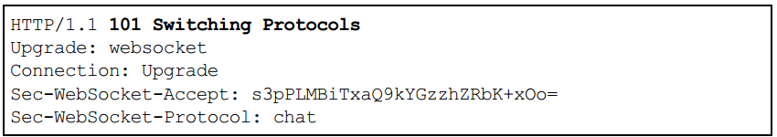
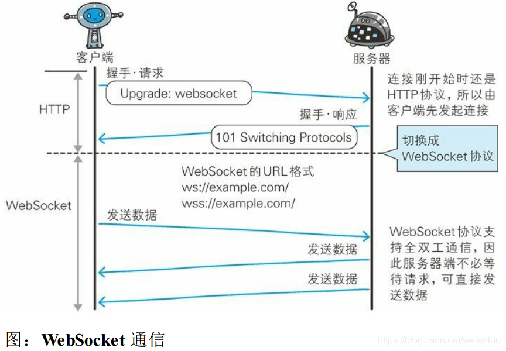

# HTTP notes

### Auth based on form

This is not a feature in http. The client will send **Credential** to the Web application and then got the authentication. This is the most common way.

#### Session and cookie

The most common way to authenticate (based on form) is by using **cookie** to manage **session**

1. client >>> ID and password >>> server (POST + HTTPS)
2. client <<< Cookie including Session ID <<< server
3. client >>> Cookie including Session ID >>> server

If this Session ID is stolen or guessed out, hackers can disguised as the original user.

The most common way to store user information (password especially) is to add **salt** (add additional information, this is usually generated randomly by the server) and then use **hash** and then store the values.


## Some other protocols based on HTTP

### SPDY

#### Limitation of HTTP

In order to know whether there is any new information on the server, the client has to request continuously. If there is no news, this kind of telecommunication is wasted. Some of these HTTP characteristics are also the limitations:

- Only one request on one connection 

- Request can only start from the client. The server cannot accept other instructions other than responses.
- Requests/Responses headers are not compressed. The larger the headers, the more apparent the delay.
- Sending lengthy headers. Most of them are very similar or even the same.
- Can choose compression style arbitrarily. It's also not obliged.

#### Ajax Solution

**Asynchronous Javascript and XML** use Javascript and **DOM (Document Object Model)** to update only part of the page!

The core technology is the **API** called **XMLHttpRequest**. Through Javascript the the client can start HTTP communication. This enables the loaded page to launch a request and update only part of the page.

However, Ajax doesn't solve the HTTP's radical problems. Ajax still needs a lot of http communication.

#### Comet Solution

Once the server has new information, it answer requests immediately. Through Delayed Responses, this solution simulates the function of **Server Push**.

Comet hangs the server. This means the server will need even more resources. Again, Comet doesn't solve the http's problems.

#### SPDY Protocol

SPDY aims to solve problems in the protocol layer.

##### Design and Functionality

SPDY doesn't change HTTP completely. Instead, it adds a Session layer between the application layer and the Transport layer. It also uses SSL to ensure security.

SPDY realizes:

- Multiplexed stream
- Priority of requests
- Compressed http headers
- Push function
- Server prompt function

##### Limitations of SPDY

SPDY realizes Multiplexed stream only in a single domain (IP address). When using only one domain, the optimization is very limited.

Many other problems on the Web are not originated by the limitations of http.


### Duplex WebSocket

#### WebSocket Procotol

Once the Web server and the client has start connection based on WebSocket Protocol, all  the communication should use this protocol. Any type of data can be used, like **JSON(Javascript Object Notation)**, **XML**, **HTML** or image.

Since this protocol is also based on HTTP, only the client can initiate a connection. Once the connection is established, any side can send datagrams.

- Push: the server can just send data.
- Eliminate traffic: the connection holds. No need to send requests over and over again.

To accomplish the WebSocket communication, a **Handshaking** is required:

- Handshake/request 

  Upgrade is to tell the server to change protocol.

  Sec-WebSocket-Key includes the necessary key-values

  Sec-WebSocket-Protocol includes the subProtocol used.

- Handshake/response

  Sec-WebSocket-Accept is generated by Sec-WebSocket-Key

  

- WebSocket API

  Javascript can use "WebSocket API".

  ```js
  var socket = new WebSocket('ws://game.example.com:12010/updates');
  socket.onopen = function () {
      setInterval(function() {
          if (socket.bufferedAmount == 0)
              socket.send(getUpdatData());
      }, 50);
  }
  ```

### HTTP/2.0

 