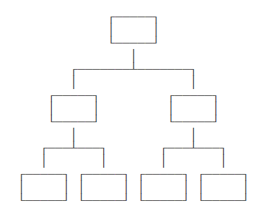
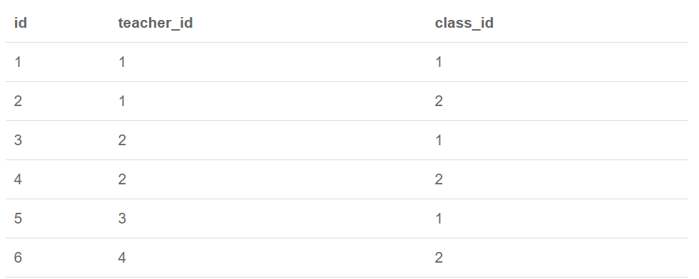
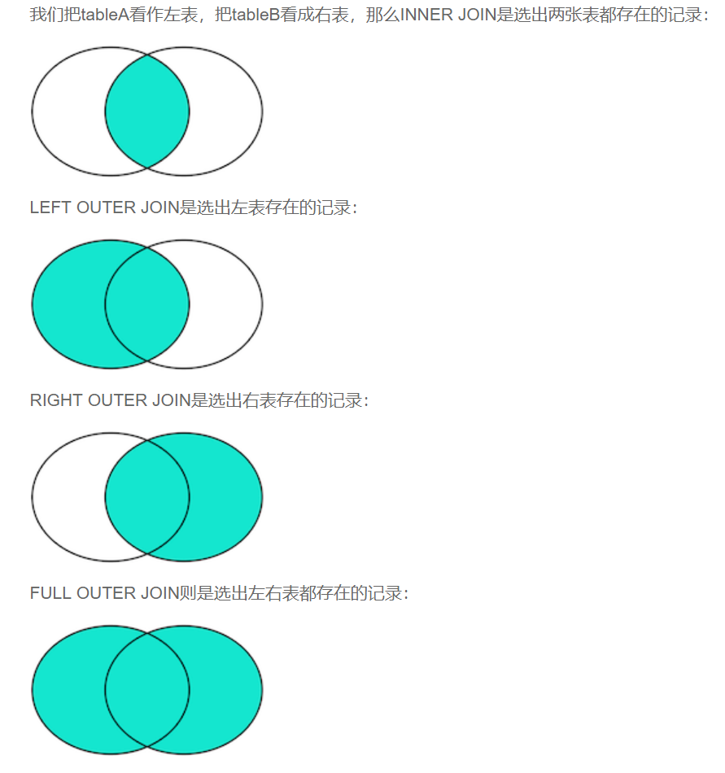

# SQL notes

### Hierarchical mode, Mesh model and Relational model




## SQL

**Standardized Query Language** can:

- DDL: Data Definition Language
  - Define the structure of data, such as creating/dropping/altering tables.
  - Handled by database admin.
- DML: Data Manipulation Language
  - Adding, deleting, updating data for users controlled by apps.
- DQL: Data Query Language
  - Allowing the user to query data, which is the most frequent manipulation in databases.

## Relation model

For every row, it's called **Record**. (记录)

For every column, it's called **Column**.(字段)Each row has several columns.

> Normally, we should avoid columns to be NULL. This can make query easier and faster.

To create a Relational DB, we need to use "one-to-one", "one-to-many", "many-to-one", "many-to-many" models. This is accomplished by things called **Primary Key** and **Foreign Key**.

### Primary Key

One important constraint for Relational DB is that any 2 records cannot be the same. This means that the **primary key** cannot be the same.

For this property, the primary key should **not** be changed after is has been set. One principle is to create a primary key which has nothing to do with business.

- **Self-incrementing Integer Type**
- **Globally Unique GUID Type**: things like `8f55d96b-8acc-4636-8cb8-76bf8abc2f57`. GUID algorithm can make sure that the strings generated are unique by **NIC(Network Interface Controller)** MAC address, time token and random number.

#### Union Primary Key

This allows programmers use more than one columns as primary key as long as at least one column is not the same. However, this can be very confusing and complex.

### Foreign Key

#### One-to-many

In the `student` table, through `class_id` column, we can connect data with another table. Such column is called **Foreign Key**. This is not accomplished by column name but something called **Foreign key constraint**.

```MYSQL
ALTER TABLE students
ADD CONSTRAINT fk_class_id
FOREIGN KEY (class_id)
REFERENCES classes (id);
```

`fk_class_id` is the name of the foreign key constraint and can be arbitrary. `FOREIGN KEY (class_id)` assigns `class_id` to be a foreign key. `REFERENCES classes (id)` assigns this foreign key to `id` in `classes`.

Since foreign key constraint can make DB slower, some apps won't set a foreign constraint. In this case, `class_id` is just a normal column.

To delete:

```mysql
ALTER TABLE students
DROP FOREIGN KEY fk_class_id;
```

This won't delete the column!

#### Many-to-many

In this case, we need to get a **intermediate table** involved.



#### One-to-one

Why do we need one more table?

- Sometimes, there are some NULL values!
- Separate frequently used info with the less frequently. This improves the performance.

### Index

Index is a kind of data structure that pre-sorts the one or several columns. This prevents the DB from scanning the whole table.

If we often query by `score`, we can create an index based on `score`:

```MYSQL
ALTER TABLE students
ADD INDEX idx_score (score);
```

The efficiency depends on whether the values are hashed. The more they are different from each other, the more efficient the query will be.

The advantage: improve query performance.

The disadvantage: need to update the index each time. Inserting/updating/deleting will be slower.

#### Unique Index

Email addresses and something like that are not appropriate for primary keys. But they are suitable for indexing!

```mysql
ALTER TBALE students
ADD UNIQUE INDEX uni_name (name);
```

Or we can add a unique constraint. This will make the column unique while not creating an index.

```MYSQL
ALTER TABLE students
ADD CONSTRAINT uni_uniname UNIQUE (name);
```

## Basic SQL

#### Basic query

```mysql
SELECT * FROM classes;
SELECT 100+200;
```

SELECT  statements without FROM can be useful. `SELECT 1;` can be used to find out whether the connection to DB is valid!

#### Conditional query

```MYSQL
SELECT * FROM student WHERE (score < 80 OR score > 90) AND gender = 'M';
SELECT * FROM student WHERE score BETWEEN 60 AND 90;
SELECT * FORM student WHERE name LIKE 'Edg%'; //% can be anything
```

#### Projection query

```mysql
SELECT id, score points, name FROM students; // re-name the same time
```

#### Sorting

```MYSQL
SELECT id, name, gender, score FROM students ORDER BY score;
SELECT id, name, gender, score FROM students ORDER BY score DESC;
SELECT id, name, gender, score FROM students ORDER BY score DESC, gender;
SELECT id, name, gender, score FROM students WHERE class_id = 1 ORDER BY score DESC;
```

#### Pagination

```mysql
SELECT id, name, gender, score FROM stuents ORDER BY score DESC LIMIT 3 OFFSET 3;
```

`LIMIT` = `pageSize`

`OFFSET` = `pageSize * (pageIndex - 1)`

#### Aggregate query

```mysql
SELECT COUNT(*) FROM students;
SELECT COUNT(*) num FROM students; //re-name (can return 0)
SELECT COUNT(*) buys FROM students WHERE gender = 'M';
```

Some other Aggregate functions: `SUM`, `AVG`, `MAX`, `MIN` (can return NULL).

##### Grouping

```MYSQL
SELECT class_id, COUNT(*) num FROM student GROUP BY class_id;
SELECT class_id, COUNT(*) num FROM student GROUP BY class_id, gender;
SELECT class_id, AVG(score) FROM student GROUP BY class_id;
```

### Multi-table Query

```mysql
SELECT * FROM students, classes;
```

The structure of the result will be the **product** of the two tables.

We can also give an alias to the result:

```MYSQL
SELECT
	students.id sid,
	students.name,
	students.gender,
	students.score,
	classes.id cid,
	class.name cname
FROM students, classes;

SELECT
	s.id sid,
	s.name,
	s.gender,
	s.score,
	c.id cid,
	c.name cname
FROM students s, classes c
WHERE s.gender - 'M' AND c.id = 1;
```

#### Join query

```MYSQL
SELECT s.id, s.name, s.class_id, c.name class_name, s.gender, s.score FROM students s INNER JOIN classes c ON s.class_id = c.id;
```

1. Choose the primary table by `FROM ...`
2. Choose the connected table by `INNER JOIN ...`
3. Choose the condition by `ON ...`
4. (Optional) `WHERE`/`ORDER BY`

`LEFT OUTER JOIN` returns all the rows that exist in the left table. Similarly, we have `RIGHT OUTER JOIN` and `FULL OUTER JOIN`



## CURD

**Create, Retrieve, Update, Delete**.

**SELECT, INSERT, UPDATE, DELETE**

### INSERT

```MYSQL
INSERT INTO students (class_id, name, gender, score) VALUES
(1, "TOM", "M", 87),
(2, "MARY", "F", 88);
```

### UPDATE

``` mysql
UPDATE students SET name="Elf", score=66 WHERE id=1;
UPDATE students SET name="Elf" WHERE id>=5 AND id<=7;
UPDATE students SET score=score+10 WHERE score<80;
UPDATE students SET score=100 WHERE id=999; //nothing will be changed
UPDATE students SET score=60; // everything will be changed!
```

### DELETE

```MYSQL
DELETE FROM students WHERE id=1;
DELETE FROM students WHERE id>=5 AND id<=7;
DELETE FROM students WHERE id=999; // nothing will be deleted
DELETE FROM students; //everything will be deleted!
```

## Other useful statements

```mysql
REPLACE INTO students (id, class_id, name, gender, score) VALUES (1, 1, 'TOM', 'M', 99);

INSERT INTO students (id, class_id, name, gender, score) VALUES (1, 1, 'TOM', 'M', 99) ON DUPLICATE KEY UPDATE name='TOM', gender='M', score=99;

INSERT IGNORE INTO students (id, class_id, name, gender, score) VALUES (1, 1, 'TOM', 'M', 99);

CREATE TABLE students_of_class1 SELECT * FROM students WHERE class_id=1;


CREATE TABLE statistics (
	id BIGINT NOT NULL AUTO_INCREMENT,
    class_id BIGINT NOT NULL,
    average DOUBLE NOT NULL,
    PRIMARY KEY (id)
);
INSERT INTO statistics (class_id, average) SELECT class_id, AVG(score) FROM students GROUP BY class_id;
```

## Transaction

**ACID**:

- Atomic
- Consistent
- Isolation
- Duration

```mysql
BEGIN;
UPDATE accounts SET balance = balance - 100 WHERE id = 1;
UPDATE accounts SET balance = balanve + 100 WHERE id = 2;
COMMIT;
```

