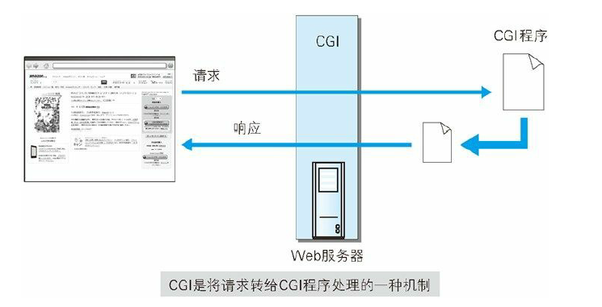

# HTTP notes

## HTTP/2.0

- SPDY
- HTTP Speed + Mobility
- Network-Friendly HTTP Upgrade

## WebDAV

**Web-based Distributed Authoring and Versioning**

- Collection: manage a bunch of files
- Resource: files and collections
- Property: "key = value"
- Lock

To accomplish WebDAV, HTTP/1.1 gets more methods:

- PROPFIND: get properties
- PROPPATCH: modify properties

- MKCOL: make a collection
- COPY: copy resources and properties
- MOVE: move resources
- LOCK: add lock to resources
- UNLOCK

And there are several status codes.

> Why is HTTP so popular?
>
> :80/tcp is HTTP, :443/tcp is HTTPS

## Methods to Build Web

### HTML CSS 

### Dynamic HTML

JavaScript >>> HTML

DOM(Document Object Model) >>> HTML element

```javascript
<script type="text/javascript">
	var content = document.getElementByTagName('P');
	content[2].style.color = "#FF0000";
</script>
```

### Web applications

Some HTMLs are created by programmers while others are created by programs. The former are called **static**, the latter is called **dynamic**.

#### CGI

**Common Gateway Interface**: After the Web server receives the request, the actions taken by it is called CGI. Programs will do some actions like creating HTML and other dynamic content.



#### Servlet (mainly because the popularity of JAVA)

This program runs in the same process with the Web application, which is faster than CGI when the traffic is very heavy.

## Data Publishing Format and Language

**XML(eXtensible Markup Language)** is a kind of simplified **SGML(Standard Generalized Markup Language)**. Through XML, share info on the Internet is easier.

Once the parse app for the HTML fail

```xml
<研讨会 编号="TR001" 主题="Web应用程序脆弱性诊断讲座">
<类别>安全</类别>
<概要>为深入研究Web应用程序脆弱性诊断必要的…</概要>
</研讨会>
<研讨会 编号="TR002" 主题="网络系统脆弱性诊断讲座">
<类别>安全</类别>
<概要>为深入研究网络系统脆弱性诊断必要的…</概要>
</研讨会>
```

