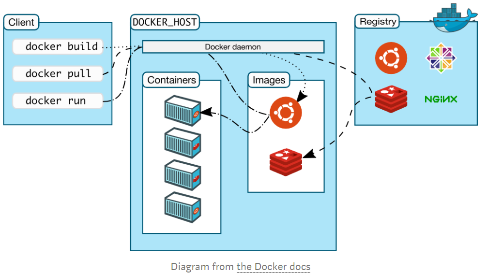

# Docker notes

### Image

Docker images are the immutable master template that is used to pump out containers that are all exactly alike. An image contains the Dockerfile, libraries, and code your app needs to run, all bundled together.

### Dockerfile

A Dockerfile is a file with instructions for how Docker should build your image.

### Docker Container

`docker run image_name` creates and starts a container from an image.

### Container Registry

## Cooking with Docker

Recipe: the *Dockerfile*.

Layers: 

- Ubuntu parent image. It's the *bottom layer* and gets built first.
- *Installing an external library* -----for example NumPy.
- *Code in a file* that you wrote to run the app.

## Docker Essentials

### Docker Platform

This is Docker's software that provides the ability to package and run an application in a container on any Linux server.

### Docker Engine

This is the client-server application. There are *Docker Community Edition* and *Docker Enterprise*.

### Docker Client

The primary way you'll interact with Docker. **Docker Command Line Interface**: type a command into your terminal that starts with `docker`. Docker Client then uses the Docker API to send the command to the Docker Daemon.

### Docker Daemon

The Docker server that listens form Docker API requests. It manages images, containers, networks, and volumes.

### Docker Volume

The best way to store the persistent data that your apps consume and create.

### Docker Registry

The remote location where Docker Images area stored. **Docker Hub** is the largest registry of Docker images.

### Docker Repository

A collection of Docker images with the same name and different tags. The *tag* is the identifier for the image. Eg:*Python:3.7-slim*

## Scaling Docker

These concepts relate to using multiple containers at once.

### Docker Networking

This allows you to connect Docker containers together. Connected Docker containers could be on the same host or multiple hosts.

### Docker Compose

A tool that makes it easier to run apps that require multiple Docker containers. This allows you to move commands into a `docker-compose.yml` file for reuse.

### Docker Swarm

A product to orchestrate container deployment.

### Docker Service

Services are really just "containers in production". A service only runs one image, but it codifies the way that image runs. Docker services allow you to scale containers across multiple Docker Daemons and make Docker Swarms possible.

### Kubernetes

It automates deployment, scaling, and management of containerized applications. However, this is not an official part of Docker.

## Getting Hands Dirty!

Remember: The Docker image is created at build time and the Docker container is created at run time.

The Docker file is very important. It should be in the current working directory when `docker build` is called to create an image. A different location can be specified with the file flag `-f`.

### Some commands

`FROM` — specifies the base (parent) image.
`LABEL` —provides metadata. Good place to include maintainer info.
`ENV` — sets a persistent environment variable.
`RUN` —runs a command and creates an image layer. Used to install packages into containers.
`COPY` — copies files and directories to the container.
`ADD` — copies files and directories to the container. Can upack local .tar files.
`CMD` — provides a command and arguments for an executing container. Parameters can be overridden. There can be only one CMD.
`WORKDIR` — sets the working directory for the instructions that follow.
`ARG` — defines a variable to pass to Docker at build-time.
`ENTRYPOINT` — provides command and arguments for an executing container. Arguments persist. 
`EXPOSE` — exposes a port.
`VOLUME` — creates a directory mount point to access and store persistent data.