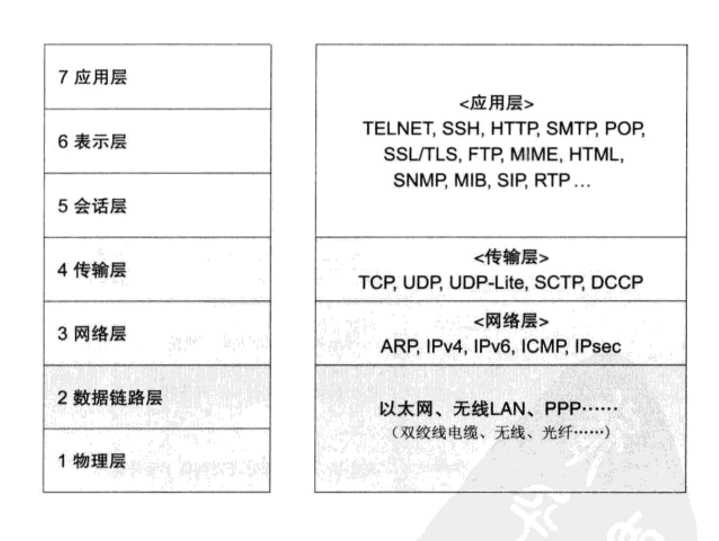

# TCP/IP notes

## The History

1. Batch Processing
2. TSS (Time Sharing System)
3. Connection between computers
4. Computer Network
5. Spread of Internet
6. The Internet becomes the core of the era.
7. Everything is related to TCP/IP

### Protocol

