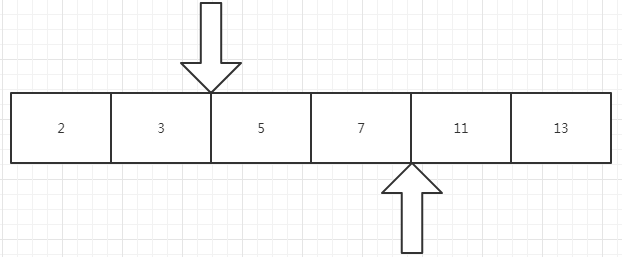

# Go notes


## Pointers

`var p *int`

`p = &i`

```go
fmt.Println(*p)
*p = 21
```

Go has no pointer arithmetic.


## Structs

```go
package main

import "fmt"

type Vertex struct{
    X int
    y int
}

func main() {
    v:= Vertex{1, 2}
    v.x = 4
    fmt.Println(v.x)
}
```

### Pointers to structs

Struct fields can be accessed through a struct pointer.

`(*p).x` is okay. `p.x` is more simple.

```go
func main() {
    v := Vertex{1, 2}
    p := &v
    p.x = 1e9
    fmt.Println(v)
}
```

### Struct Literals

```go
type Vertex struct {
    X, Y int
}

var (
    v1 = Vertex{1, 2}
    v2 = Vertex{X: 1} // Y:0 is implicit
    v3 = Vertex{} // X:0, Y:0
    p = &Vertex{1, 2}
)
```

## Arrays

`var a [10]int`

An array's length is part of its type, so arrays cannot be resized. 

```go
func main() {
    var a [2]string
    a[0] = "Hello"
    a[1] = "world"
    fmt.Println(a[0], a[1])
    fmt.Printlb(a)
    
    primes := [6]int{2, 3, 5, 7, 11, 13}
    fmt.Println(primes)
}
```

### Slices

Dynamically-sized view into the elements of an array. Type `[]T` is a slice with elements of type T.

`var s []int = primes[1:4]`

Slice has **Defaults**. User can omit the low bound and the high bound.

#### Slices are like references to arrrays

A slice **does not** store any data! Changing the elements of a slice modifies the corresponding elements of its underlying array. Other slices that share the same underlying array will see those changes.

```go
func main() {
    names := [4]string{
        "John"
        "Paul"
        "George"
        "Ringo"
    }
    fmt.Println(names)
    
    a := names[0:2]
    b := names[1:3]
    fmt.Println(a, b)
    
    b[0] = "XXX"
    fmt.Println(a, b, names)
}
```

### Slice literals

`[]bool{true, ture, false}` creates an array then builds a slice that references it.

```go
func main() {
    a := []int{2, 3, 5, 7, 11, 13}
    
    r := []bool{true, true, false}
    
    s := []struct {
        i int
        b bool
    }{
        {2, true}
        {3, false}
        {7, true}
    }
}
```

### Slice length and capacity

`len(s)` and `cap(s)`



```go
func main() {
    s := []int{2, 3, 5, 7, 11, 13}
    printSlice(s)
    
    s = s[:0]
    printSlice(s)
    
    s = s[:4]
    printSlice(s)
    
    s = s[2:]
    printSlice(s)
}

func printSlice(s []int) {
    fmt.Printf("len=%d cap=%d %v\n", len(s), cap(s), s)
}
```

### Nil slices

`var s []int` has no underlying array. `s == nil`

### Creating a slice with make

```go
func main() {
    a := make([]int, 5) // [0 0 0 0 0]
    b := make([]int, 0, 5) // []
    c = b[:2]
    d := c[2:5]
}
```

### Slices of slices

```go
package main

import (
	"fmt"
    "strings"
)

func main() {
    board := [][]string{
        []string{"_", "_", "_"},
        []string{"_", "_", "_"},
        []string{"_", "_", "_"},
    }
    
    board[0][0] = "X"
    board[2][2] = "O"
    board[1][2] = "X"
    board[1][0] = "O"
    board[0][2] = "X"
    
    for i := 0; i < len(board); i++{
        fmt.Printf("%s\n", strings.Join(board[i], " "))
    }
}
```

### Appending to a slice

```go
package main

import "fmt"

func main() {
    var s []int
    printSlice(s)
    
    s = append(s, 0) // if the backing array of s is too small,
    				 // a bigger array will be allocated.
    printSlice(s)
    
    s = append(s, 1)
    printSlice(s)
    
    s = append(s, 2, 3, 4, 5)
    printSlice(s)
}
```

### Range

```go
var pow = []int{1, 2, 4, 8, 16}

func main() {
    for i, v := range pow { // index, element
        fmt.Printf("2**d = %d\n", i, v)
    }
}
```

`for i, _ := range pow` and `for _, v := range pow` to skip. If you only want the index, use `for i := range pow`


### Exercise of Slice

```go
package main

import "golang.org/x/tour/pic"

func Pic(dx, dy int) [][]uint8 {
	s := make([][]uint8, dy)
	for i := 0; i < dy; i++{
		s[i] = make([]uint8, dx)
	}
	
	for y := 0; y < dy; y++{
		for x := 0; x < dx; x++{
			s[y][x] = uint8(x*y/2)
		}
	}
	return s
}

func main() {
	pic.Show(Pic)
}
```


## Maps

A map maps keys to values. The zero value of a map is `nil`. A `nil` map has no keys, nor can keys be added.

> what does it mean?

The `make` function returns a map of the given type, initialized and ready for use.

```go
package main

improt "fmt"

type Vertex struct {
    Lat, Long float64
}

var m map[string]Vertex

func main() {
    m = make(map[string]Vertex)
    m["Bell Labs"] = Vertex{
        40.68433, -74.39967,
    }
    fmt.Println(m["Bell Labs"])
}
```

### Map literals

```go
var m = map[string]Vertex{
    "Bell Labs": Vertex{
        40.68433, -74.39967,
    },
    "Google": Vertex{
        37.42202, -122.08408,
    },
}
```

If the top-level type is just a type name, you can omit it from the elements of the literal.

> top-level type?
>
> ```c++
> namespace Foo
> {
>     class Bar {} // top-level class
> }
> ```
>
> ```c++
> namespace Foo
> {
>     class Bar
>     {
>         class Baz {} // nested type
>     }
> }
> ```

### Mutating Maps

```go
package main

import "fmt"

func main() {
    m := make(map[string]int)
    
    m["Answer"] = 42
    fmt.Println("The value: ", m["Answer"])
    
    m["Answer"] = 48
    fmt.Println("The value: ", m["Answer"])
    
    delete(m, "Answer")
    fmt.Println("The value: ", m["Answer"])
    
    v, ok := m["Answer"]
    fmt.Println("The value: ", n, "Present?", ok)
}
```

### Exercises Maps

Implement `WordCount`. It should return a map of the counts of each “word” in the string `s`. The `wc.Test` function runs a test suite against the provided function and prints success or failure.

```go
package main

import (
	"golang.org/x/tour/wc"
	"strings"
)

func WordCount(s string) map[string]int {
	m := make(map[string]int)
	words := strings.Fields(s)
	
	for _, word := range words{
		m[word] += 1	
	}
	
	return m
}

func main() {
	wc.Test(WordCount)
}

```

## Function values

**Functions are values too!**

Function values can be used as function arguments and return values.

```go
package main

import (
	"fmt"
    "math"
)

func compute(fn func(float64, float64) float64) float64{
    return fn(3, 4)
}

func main() {
    hypot := func(x, y float64) float64{
        return math.Sqrt(x*x, y*y)
    }
    fmt.Println(hypot(5, 12))
    
    fmt.Println(compute(hypot))
    fmt.Println(compute(math.Pow))
}
```

### Function closures

A closure is a function value that references variables from outside its body. The function can access and assign to the referenced variables.

**The main idea of closure is to capture variables outside!**

```go
package main

import "fmt"

func adder() func(func int) int { // return type: func int
    sum := 0
    return func(x int) int { //sum is captured
        sum += x
        return sum
    }
}

func main() {
    pos, neg := adder(), adder()
    for i := 0; i < 10; i++{
        fmt.Println(
            pos(i)
            neg(-2*i)
        )
    }
} //release pos and neg, thus release sum*2
```

### Exercise: Fibonacci closure

```go
package main

import "fmt"

// fibonacci is a function that returns
// a function that returns an int.
func fibonacci() func() int {
	a1, a2 := 0, 1
	count := 0
	return func() int {
		switch count++; count {
			case 1:
				return a1
			case 2:
				return a2
			default:
				result := a1 + a2
				a1 = a2
				a2 = result
				return result
		}
	}
}

func main() {
	f := fibonacci()
	for i := 0; i < 10; i++ {
		fmt.Println(f())
	}
}
```

Another method:

```go
package main

import "fmt"

// fibonacci is a function that returns
// a function that returns an int.
func fibonacci() func() (int, int) {
	a1, a2 := -1, 1
    return func() (int, int) {
		a1 = a1 + a2
        a2 = a1 + a2
        return a1, a2
	}
}

func main() {
	f := fibonacci()
	for i := 0; i < 10; i++ {
		fmt.Println(f())
	}
}
```


## Methods

Define methods on types. It's a function with a special *receiver* argument.

```go
type Vertex struct {
    X, Y float64
}

func (v Vertex) Abs() float64 {
    return math.Sqrt(v.X*v.X + v.Y*v.Y)
}

func main() {
    v := Vertex{3, 4}
    fmt.Pirntln(v.Abs())
}
```

For non-struct types:

```go
type MyFloat float64

func (f MyFloat) Abs() float64 {
    if f < 0{
        return float64(-f)
    }
    return float64(f)
}
```

### Pointer receivers

Methods with pointer receivers can modify the value to which the receiver the value to which the receiver points. Pointer receivers are **more common** than value receivers.

```go
func (v *Vertex) Scale(f float64) // no return type
{
    v.X = v.X * f
    x.Y = v.Y * f
}
```

#### Methods and pointer indirection

```go
var v Vertex
ScaleFunc(v, 5)  // Compile error!
ScaleFunc(&v, 5) // OK

v.Scale(5)  // OK
p := &v
p.Scale(10) // OK
```

Go interprets the statement `v.Scale(5)` as `(&v).Scale(5)` since `Scale` method has a pointer receiver.

#### Choosing a value or pointer receiver

Advantage of pointer receiver:

- modify the variable
- avoid copying every time

