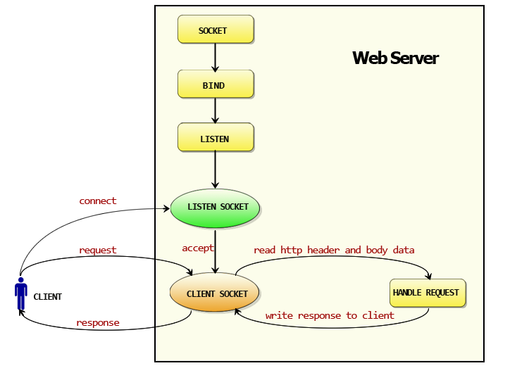
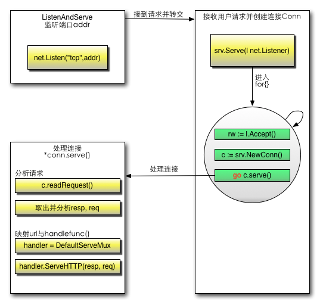

# Go and Web

## Function of Web

### URL and DNS

`scheme://host[:port#]/path/.../[?query-string][#anchor]`

**DNS**: 

1. OS will check out local `hosts` doc
2. If `hosts` doesn't possesses the map, check out `local DNS parser cache`
3. Checkout the `local DNS Server` (in the TCP/IP configuration)
   - If the domain name is in the DNS server's resources, this resolution is authoritative
   - If the domain name is not in the DNS server's resources but it's cached, this resolution is not authoritative.
4. If DNS local resources and cached resolution fail:
   - transmission mode off: to the `root DNS server`
   - transmission mode on: to the  `Superior DNS server`

## HTTP Protocol

HTTP Protocol is **Stateless**: the server doesn't know whether the requests are from the same client. To solve this, Web apps import **Cookies**

### HTTP request package

```
GET /domains/example/ HTTP/1.1        //请求行: 请求方法 请求URI HTTP协议/协议版本
Host：www.iana.org                //服务端的主机名
User-Agent：Mozilla/5.0 (Windows NT 6.1) AppleWebKit/537.4 (KHTML, like Gecko) Chrome/22.0.1229.94 Safari/537.4            //浏览器信息
Accept：text/html,application/xhtml+xml,application/xml;q=0.9,*/*;q=0.8    //客户端能接收的mine
Accept-Encoding：gzip,deflate,sdch        //是否支持流压缩
Accept-Charset：UTF-8,*;q=0.5        //客户端字符编码集
//空行,用于分割请求头和消息体
//消息体,请求资源参数,例如POST传递的参数
```

#### GET and POST

1. GET request's body is empty while POST's is not.
2. GET's data are put in URL, `?` is used to separate URL and data, `&` is used to connect parameters. `EditPosts.aspx?name=test1&id=123456`. POST method place the data in the HTTP package's body part.
3. The size of data submitted by GET is limited because the URL length is limited by browsers. The size of data carried by POST package is unlimited.
4. GET method is not safe.

### HTTP Response package

```
HTTP/1.1 200 OK                        //状态行
Server: nginx/1.0.8                    //服务器使用的WEB软件名及版本
Date:Date: Tue, 30 Oct 2012 04:14:25 GMT        //发送时间
Content-Type: text/html                //服务器发送信息的类型
Transfer-Encoding: chunked            //表示发送HTTP包是分段发的
Connection: keep-alive                //保持连接状态
Content-Length: 90                    //主体内容长度
//空行 用来分割消息头和主体
<!DOCTYPE html PUBLIC "-//W3C//DTD XHTML 1.0 Transitional//EN"... //消息体
```

#### HTTP Code

- 1XX HTTP prompt information
- 2XX Success
- 3XX Redirect
- 4XX Client Error
- 5XX Server Error

#### Connection: keep-alive

**Stateless** means this protocol cannot record things, this doesn't mean that HTTP cannot sustain TCP connection.

## HTTP Package and Establishment of a Web Server

### Important  Concepts

- Request, includes post, get, cookie, url
- Response
- Conn
- Handler

### The function of HTTP package





## Form

### Dealing with the input of a Form

```html
<form action="/login" method="post">
    用户名:<input type="text" name="username">
    密码:<input type="password" name="password">
    <input type="submit" value="登陆">
</form>
```

To process the data transmitted in, in go

```go
func login(w http.ResponseWriter, r *http.Request) {
    fmt.Println("method:", r.Method) //获取请求的方法
    if r.Method == "GET" {
        t, _ := template.ParseFiles("login.gtpl")
        t.Execute(w, nil)
    } else {
        //请求的是登陆数据，那么执行登陆的逻辑判断
        r.ParseForm() // handler内不会自动解析form，需要显式调用
        fmt.Println("username:", r.Form["username"])
        fmt.Println("password:", r.Form["password"])
    }
}

func main() {
    http.HandleFunc("/login", login)
    err := http.ListenAndServe(":8080", nil)
    if err != nil {
        log.Fatal("ListenAndServe", err)
    }
}
```

